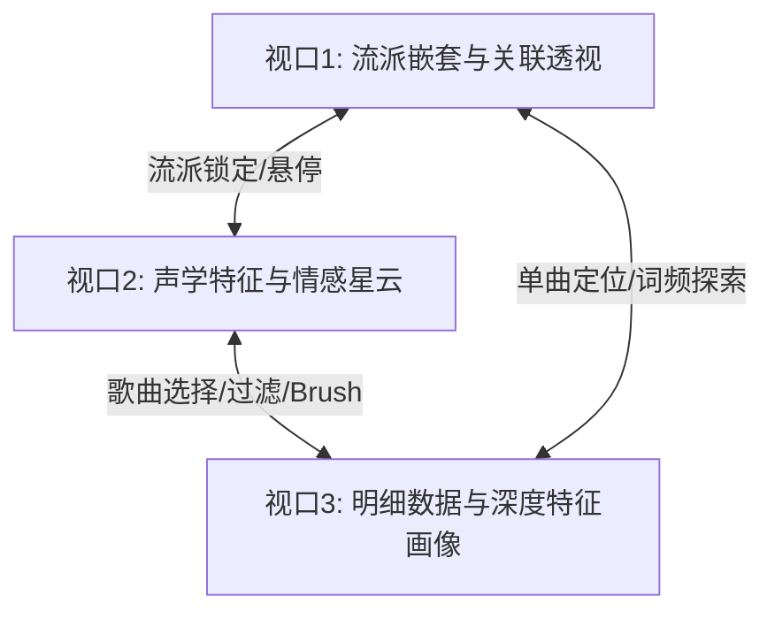

# 🎵 Music Dimension Visualizer - 前端交互分析系统

### 音乐流派与声学特征高维交互可视化驾驶舱

> **项目定位**：本项目是一个基于 Spotify 经典音乐数据集（1960-2020）的多维声学与文化特征交互分析系统。系统旨在帮助音乐研究人员、音乐疗愈师及音乐爱好者以多视角、强联动的可视化方式剖析音乐流派、声学特征、情感倾向与歌词文化之间的深层关联。
> **技术栈**：`React 18` + `Vite` + `ECharts 5` + `Vanilla CSS`
> **数据源**：`public/data.json`（经过 Python 离线预处理、汉化及 KMeans 聚类归档）

---

## 1. 需求背景与功能设计

### 1.1 需求背景
随着数字音乐平台的爆发式增长，音乐数据呈现出海量、高维和异构的特点。传统的音乐检索与分类往往仅停留在简单的“流派标签”或“歌手名称”层面，难以满足以下深层次的分析需求：
1. **多维特征剖析**：音乐包含可舞度、能量、声学度、愉悦度等多维度的物理与心理声学特征，如何直观对比不同流派的特征差异？
2. **情感映射分析**：如何将抽象的音乐情感（如快乐、悲伤、激昂、宁静）合理量化，并展示在二维低维空间中？
3. **流派演变与融合度分析**：现代流派相互杂交融合，如何展示流派之间的亲缘关系与融合程度？
4. **词汇文化与声学关联分析**：特定流派中高频出现的情感词汇与该流派的声音风格（如旋律、节奏等物理声学特征）之间，是否存在情感表达上的一致对应关系？

### 1.2 系统功能架构
为了满足上述需求，本系统构建了一个具备完整交互分析功能的“极客驾驶舱”，包含以下核心功能：
- **流派多层嵌套与融合分析**：支持通过旭日图洞察流派树状层级，通过弦图洞察流派间的融合度。
- **高维声学特征透视**：通过七维雷达图对流派及单曲进行多指标实时对比。
- **KMeans 情感空间划分**：使用 KMeans 算法和 Voronoi 剖分将高维声学数据降维投影到“能量-愉悦度”二维空间。
- **流派与词频画像分析**：提供流派发展变迁折线图与文本特征词云，并支持通过词频加权分析词汇所蕴含的声音与情感特征。
- **双向联动歌曲探索**：配合高阶筛选与单曲反向高亮定位，完成“全局洞察-局部锁定-微观过滤”的完整交互链条。

---

## 2. 交互可视化视口设计与联动机制

本系统将整个屏幕空间规划为三个核心可视化视口，每个视口各司其职，并通过数据流进行高灵敏的双向联动：



### 2.1 视口 1：流派嵌套与融合关联视口（左栏）
- **功能职责**：负责流派在结构层面的解构。包含**双层嵌套旭日图**与**跨流派关联弦图**两种视角。
- **功能细节**：
  - **旭日图模式**：外圈代表细分流派，内圈代表大类流派。根据各流派的流行度，引入**自适应亮度衰减因子**，低流行度节点自动降低亮度以减少视觉噪点。
  - **弦图模式**：节点连接弧线代表不同细分流派在歌曲中的跨流派共存度或演变亲和度。

### 2.2 视口 2：声学特征与情感投影视口（中栏）
- **功能职责**：负责音乐物理属性与心理学情感维度的特征映射。包含**声学特征雷达图**与**KMeans 情感空间散点图**。
- **功能细节**：
  - **多维雷达图**：展示可舞度、能量、声学度、情感效价 (Valence)、活跃度、器乐度、言语度共 7 个声学维度。支持单选展示和多选（2-4个流派）对比。
  - **KMeans 情感散点图（Voronoi 平面）**：将歌曲按“能量-情感效价”投影在直角坐标系中，并通过 KMeans 聚类区域进行着色。

### 2.3 视口 3：明细数据与深度特征透视视口（右栏及悬浮舱）
- **功能职责**：提供微观层面的单曲属性和上下文画像。包含**歌曲列表**、**流派画像悬浮窗**、**歌词特征透视窗**以及**单曲多维声学特征比对窗**。
- **功能细节**：
  - **歌曲列表**：通过彩色圆点对歌曲的流派、聚类类别进行物理位置编码，支持按流行度排序与滚动。
  - **上下文悬浮窗**：具备自由拖拽功能的玻璃拟态小窗口，提供深度的流派时空变迁折线图、文本特征词云及单曲三线雷达偏差比对。

### 2.4 视口间的交互联动机制
本系统设计了无断点的双向交互闭环，降低用户的认知负荷：
1. **流派悬停/锁定联动（视口1 ➡️ 视口2）**：在旭日图/弦图中悬停某流派，雷达图瞬时绘制该流派的“紫色虚影”特征；点击锁定该流派后，雷达图保持该流派的“深色实线”，同时视口 2 的 KMeans 图过滤为该流派的散点，视口 3 的歌曲表格更新为该流派歌曲。
2. **KMeans 框选联动（视口2 ➡️ 视口3）**：在 KMeans 星云图中使用鼠标进行 Brush 框选操作，右侧歌曲表格在毫秒内过滤为选定区域内的单曲。
3. **单曲反向高亮定位（视口3 ➡️ 视口2、视口1）**：在歌曲列表中点击一首单曲时，KMeans 星云图自动缩放到相应区域，该单曲粒子触发红色气泡的呼吸脉冲高亮；同时，左侧视口 1 自动定位该单曲所属流派并高亮显示，雷达图自动切换展示该歌曲的 7 维声学数据。

---

## 3. 高级可视化技术与算法实现

系统未仅停留在基本条形图、折线图等简单图表，而是引入了多种高级可视化表达与前端算法，以提供高信息密度的分析体验：

### 3.1 基于 Voronoi 剖分的情感聚类背景网格空间
- **算法实现**：系统在后台预先对数万首歌曲的 7 维声学向量进行 KMeans 聚类（K=5），得到 5 个具有不同情感特性的聚类质心。前端在 50×50 的离散网格点平面上，实时计算每个像素网格到这 5 个质心的欧氏距离，应用 **Voronoi（泰森多边形）算法**将平面划分为 5 个着色区域（狂热释放、轻松愉快、伤感静谧、阳光活力、迷幻张力），从而在散点图背景上渲染出平滑的情感边界区域。

### 3.2 弦图（Chord Diagram）描述流派融合
- **应用场景**：常规树状图无法表达跨类别的“多对多”联系。系统在弦图的圆周边缘对不同的细分流派进行分段，当某首歌曲同时被标记为多种流派特征时，将在流派之间绘制非对称的带状连接（Ribbons），刻画现代音乐流派在演进中的交叉和融合度。

### 3.3 南丁格尔玫瑰图与极坐标单轴放射柱状图的组合应用
- **歌词词频多维透视**：在展示歌词词频背后的声音情感特征时，系统避开了常规的堆叠柱状图：
  - 使用**南丁格尔玫瑰图**表征该词在不同大类流派中的频次分布，通过扇区半径和角度面积的双重视觉编码展示分布差异。
  - 使用**极坐标单轴放射柱状图**展示该词的虚拟加权声学情感向量。每一根由中心向外放射的柱条代表一个维度的声学强度，契合声学属性在心理学上的放射性特征。

### 3.4 交互微操：空间一致性位置保持算法
- **设计细节**：为了避免频繁切换探索对象时窗口闪烁或重新渲染导致的视觉迷失，系统引入了基于 React `useRef` 的**窗口位置保持机制**：
  - 无论是流派画像还是词频分析窗口，当其被拖拽到屏幕任意位置后，在切换流派或词汇时，窗口坐标将使用 Ref 进行拦截，**只在窗口从无到有打开时重置为初始位置 `{ x: 0, y: 0 }`，而在非空切换过程中绝不返回原点**，有效避免了视觉突变，保持了分析时的视觉连贯性。

---

## 4. 可视化设计原则与规范

本系统严格遵循学术界与工业界的数据可视化设计原则，确保界面的专业性、美观性与抗噪能力：

1. **色彩语义一致性（Color Semantic Consistency）**：
   - 系统的 5 个 KMeans 情绪聚类在全系统内拥有**固定的语义色彩编码**（如“轻松愉快”统一使用浅紫色 `#B4A6CD`，“伤感静谧”统一使用淡蓝色 `#A2CBE6`）。无论是背景区域、散点描边还是表格中的标签，均严格对齐，避免产生色彩认知混乱。
2. **焦点+上下文（Focus + Context）与去噪原则**：
   - 面对高密度的散点情绪图，系统在用户悬停于某一特定流派时，利用 React 虚拟 DOM 的局部刷新将其他流派粒子的透明度瞬时降至 `0.08`。此时被探索流派作为“焦点（Focus）”高亮保留，其余流派作为“上下文（Context）”以极淡的虚影呈现，在保持整体情绪空间布局的前提下剔除视觉杂音。
3. **视觉通道编码的科学性**：
   - **双重通道编码**：在歌曲列表中，不仅通过文本展示属性，而且使用彩色流派点、KMeans 聚类色小圆点和流派小胶囊进行多重位置和颜色编码，提高了视觉扫描效率。
   - **面积与半径双通道**：南丁格尔玫瑰图同时利用角度和半径编码数据大小，加强了视觉感知强度。

---

## 5. 应用案例：Mandopop（华语流行）声学与文化特征分析

以下通过一个完整的交互分析案例，验证该可视化系统的实际应用效果：

### 5.1 分析目的
探索“华语流行（华语流行）”流派在声学特征、情感分布以及文本主题上的特征分布。

### 5.2 交互探索步骤与现象记录
1. **全局定位流派层级**：
   - 在左侧视口 1 的双层旭日图中定位大类“流行”下的子节点“华语流行”。悬停时，雷达图瞬时渲染出一条由“华语流行”7 维数据组成的折线，显示其“可舞度（danceability）”和“情感效价（valence）”均处于中等偏高水平（约 `0.65`），而“器乐度（instrumentalness）”接近于零，反映了其重人声、轻器乐的特色。
2. **锁定探索基准**：
   - 点击旭日图中的“华语流行”节点，雷达图多边形被锁定（深紫色实线）。右侧歌曲明细列表秒级刷新，展现出该流派的高热度单曲（如陈奕迅的《红豆》、王菲的歌曲等）。
3. **空间分布与聚类透视**：
   - 全屏开启 KMeans 情绪星云图。在顶部流派卡片组中仅勾选“华语流行”。散点图中呈现出“华语流行”单曲的分布规律：大量单曲密集地落在代表“伤感静谧”（蓝色 `#A2CBE6`）和“轻松愉快”（紫色 `#B4A6CD`）的 Voronoi 色块区域中，几乎没有粒子落在“狂热释放”（绿色）区域。这在统计学上证实了华语流行乐多为中低能量、重情感抒发的情歌。
4. **单曲微观校验**：
   - 在右侧歌曲列表中点击经典曲目《红豆》。中栏的 KMeans 星云图反向高亮该单曲，红色光圈在“伤感静谧”区域中心频频闪烁。同时，单曲多维声学特征比对雷达图弹出，显示这首歌的“能量”为 `0.23`（远低于全球流行大盘均值），而“声学度（acousticness）”高达 `0.78`（远高于流派均值），量化证实了该曲目的抒情特异性。
5. **歌名文化与情感映射**：
   - 关闭星云图，查看流派画像小窗。词云中展示了“华语流行”的 20 个歌名高频词汇，如“Love”、“那女孩對我说”、“親愛的”、“红豆”等。
   - 点击词云中的词汇“親愛的”。歌名中词汇多维特征透视仪随即在左下角弹出。南丁格尔玫瑰图显示，“親愛的”这一词汇主要分布于“华语流行”、“粤语流行”等东亚流行流派中。极坐标单轴放射柱状图则展示了其关联的声音情感特征：加权计算后的情感效价中等偏高，可舞度较高，契合了“亲爱的”一词在中文歌曲中温馨、抒情的音乐表现。

### 5.3 案例结论
通过本系统的联动分析，我们能够直观且科学地归纳出：华语流行音乐在声学上表现为中低能量、重人声、轻器乐，情感空间归属于“伤感静谧”与“轻松愉快”聚类，词汇文化则高度聚焦在“親愛的”、“红豆”等感性与温情意象上。这充分证明了系统在分析多维异构数据方面的有效性。

---

## 6. 本地部署与运行指南

### 6.1 环境依赖
- **Node.js** (推荐使用 `v16` 或 `v18+` 稳定版本)
- **npm** (随 Node.js 一并安装)

### 6.2 启动开发服务
1. **克隆项目并进入项目目录**：
   ```bash
   cd d:/大学/大三下/数据可视化/music/spotify-vis
   ```
2. **安装前端依赖**：
   ```bash
   npm install
   ```
3. **启动开发服务器**：
   ```bash
   npm run dev
   ```
   启动成功后，在浏览器中访问终端输出的本地地址（通常为 `http://localhost:5173/`）。

4. **构建生产环境包**：
   ```bash
   npm run build
   ```
   构建好的静态文件将生成在 `dist` 目录下。

---

## 7. 数据预处理与工程优化

为确保系统在浏览器中实现高频交互（如 2500 个网格的 Voronoi 实时渲染、七维向量相似度 MAE 计算、大批歌曲高热度排序）时的流畅度（维持在 60 FPS），项目在离线阶段使用 Python 进行了针对性的预处理：
1. **汉化与大类聚合**：利用预设的流派同义词词典，对 Spotify 原始数据中杂乱的英文细分流派进行清洗归并，映射为标准中文大类（如“Pop ➡️ 流行”）与二级流派。
2. **文本挖掘**：利用 TF-IDF 对流派歌曲的歌词进行计算，提取前 20 位最具代表性的核心特征词，构建成流派画像的静态字典。
3. **前端缓存设计**：将预处理好的流派层级树（`sunburst`）、散点图坐标（`scatter`）、流派关联弦（`graph`）以及流派详情（`genre_details`）全部写入统一的 `public/data.json` 中，前端在初次加载时一次性读入，避免了频繁发起后台 API 请求带来的网络损耗与计算延迟。
